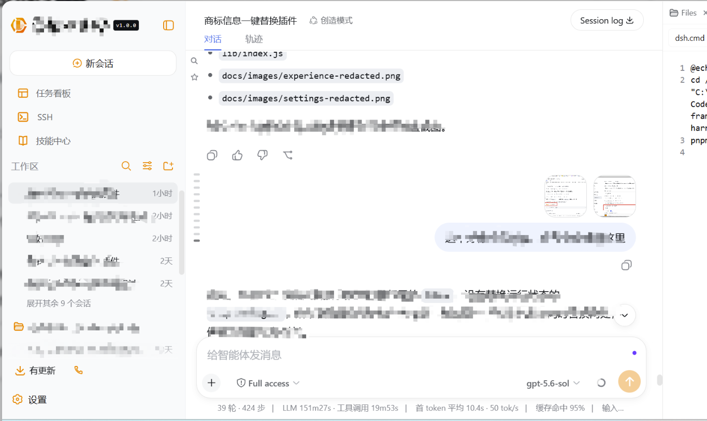
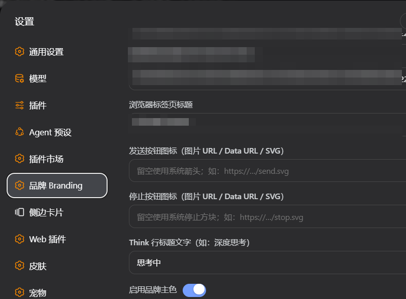

# dsh-brand · 一键品牌替换

面向 DSH Web GUI 二次开发的一键品牌插件。无需修改或重新构建 Web Shell，在 **设置 → 品牌 Branding** 中填写配置即可即时替换产品品牌。

> 当前主要兼容基线：**DSH v0.1.5-rc.1**。已核对 **DSH v0.1.5-rc.2**：品牌 Slot、设置 Slot、插件加载接口及本插件使用的会话/侧栏结构未发生不兼容变化，当前版本可直接使用。

## 使用体验

> 下图来自实际运行界面，会话标题、正文、路径和任务内容已经脱敏。



### 插件配置页

> 配置值中的 Data URL、SVG 和产品信息已经脱敏。



## 特性

- 商标 Logo：侧栏与新会话 Hero，支持文字、Emoji、图片 URL、Data URL 和原始 SVG
- 产品名称与版本徽标：支持普通文字或艺术字图片
- Hero 主标题、徽标与一句话简介
- 浏览器标签页标题与 favicon
- 思考状态文字自定义：同时替换 `Think` 行标题与 `Deep diving...` 运行状态
- 发送、停止按钮支持独立自定义图标
- 品牌主色支持手动取色或从商标自动提取主色
- 可隐藏 DSH 内测声明弹窗
- 配置保存在独立 JSON 文件，便于不同厂商分发二改版本
- 停止或卸载插件后恢复系统界面

## 品牌主色作用范围

“启用品牌主色”默认开启。颜色留空时，插件会从商标图片中采样，选取非透明、非近白区域中占比最高的颜色；手动填写颜色时，以手动颜色为准。

设置页提供品牌色作用范围多选列表，默认全部勾选，也可以按需要只保留部分 UI：

- 侧边栏操作图标
- 工作区“项目”文件夹图标
- Think / 深度思考图标与标题
- `Deep diving...` 运行状态文字
- 发送按钮与停止按钮

每项可以独立勾选或取消，并提供“全选 / 全部取消”。关闭“启用品牌主色”总开关后，上述 UI 全部恢复系统原配色，但不会清除已填写颜色和作用范围选择。旧配置没有 `colorTargets` 字段时自动按全选处理。

> **换肤兼容说明：** 商标、产品名称、版本徽标、浏览器标签页标题和 favicon 属于稳定品牌项，通常不会被 UI 换肤插件覆盖。品牌主色属于样式层增强；如果其他换肤插件使用了更高优先级规则，部分图标或文字颜色可能被覆盖，最终效果取决于样式加载顺序与选择器优先级。

## 安装

```powershell
git clone https://github.com/advance-lion/dsh-brand.git
dsh plugin --profile web add <克隆下来的 dsh-brand 目录>
```

如果当前 CLI 支持 `github:` 规格，也可以直接安装：

```powershell
dsh plugin --profile web add github:advance-lion/dsh-brand
```

本包为纯手写 ESM、零依赖、免构建，`lib/` 即产物，无需运行 `npm install` 或 build。

安装后访问 <http://127.0.0.1:3080>。若插件未出现，重启一次 `dsh web`，然后使用 `Ctrl+F5` 硬刷新。

## 使用

1. 打开 **设置 → 品牌 Branding**。
2. 填写需要替换的品牌字段。
3. 点击“保存并应用”。
4. 使用“恢复默认”可一键清空品牌配置。

Host 字段发生变化或插件首次升级后，需要重启一次 `dsh web`；普通配置修改保存后即时生效。

## 配置字段

| 字段 | 作用位置 |
| --- | --- |
| `name` | 侧栏产品名，支持文字、图片 URL、Data URL、SVG |
| `version` | 产品名称旁的自定义版本徽标；非空时优先于 DSH 构建版本 |
| `useDshVersion` | 自定义版本留空时显示当前 DSH 构建 Hash/包版本，默认 `true` |
| `headline` | 新会话 Hero 主标题 |
| `badge` | Hero 徽标 |
| `intro` | Hero 简介 |
| `logoText` | 旧版兼容字段：文字或 Emoji 商标 |
| `logoUrl` | 主商标，优先于 `logoText`；也是自动取色来源 |
| `title` | 浏览器标签页标题 |
| `favicon` | 浏览器标签页图标 |
| `sendIcon` | 发送状态图标；留空使用系统箭头 |
| `stopIcon` | 停止状态图标；留空使用系统方块 |
| `thinkText` | 同时替换 Think 行标题与 `Deep diving...` 运行状态文字 |
| `colorEnabled` | 品牌主色总开关，默认 `true` |
| `colorTargets` | 品牌主色作用范围，默认 `sidebar,project,think,diving,composer` |
| `color` | 品牌主色；留空时自动从 `logoUrl` 提取 |
| `hideNotice` | 是否隐藏 DSH 内测声明弹窗 |

配置保存在 `$DSH_HOME/dsh-brand.json`，默认位置为：

```text
C:\Users\<用户>\.dsh\dsh-brand.json
```

示例：

```json
{
  "name": "Acme Harness",
  "version": "",
  "useDshVersion": "true",
  "headline": "探索未至之境",
  "badge": "预览版",
  "intro": "面向内部的智能体工作台",
  "logoUrl": "https://example.com/logo.svg",
  "title": "Acme Harness",
  "favicon": "https://example.com/favicon.svg",
  "sendIcon": "",
  "stopIcon": "",
  "thinkText": "深度思考",
  "colorEnabled": "true",
  "colorTargets": "sidebar,project,think,diving,composer",
  "color": "",
  "hideNotice": "true"
}
```

## 实现说明

- 使用官方品牌 Slot：`sidebar.brand.mark`、`sidebar.brand.name`、`conversation.hero.brand.mark`。
- Host 提供同源 `GET/PUT /api/dsh-brand/config` 接口读写配置。
- Host 在 HTML 首屏注入品牌配置，减少刷新时默认商标、标题与 favicon 闪现。
- Hero 接管和部分精确配色使用受限作用域选择器，不修改整个应用的全局主题变量。
- Think 标题、发送/停止状态均保留原生交互语义，仅替换显示层。
